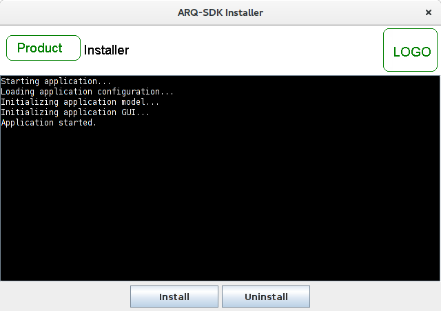
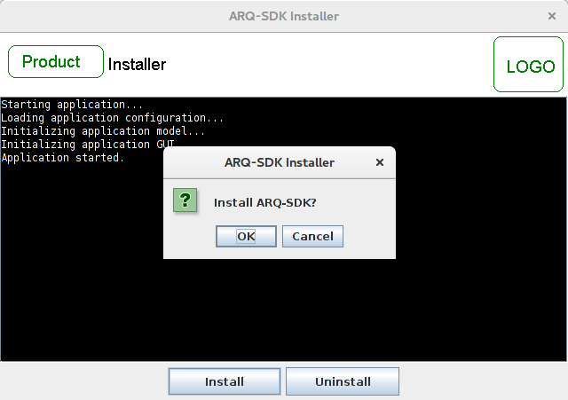
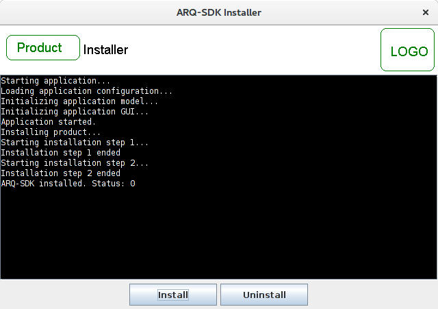
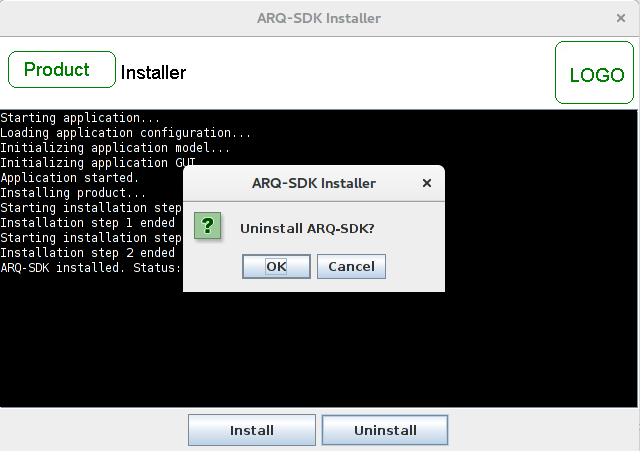

Java Installer
==============

Java Installer & Uninstaller With GUI

This is a framework to automate PC setup. For example, you can use it to automate 
the installation of a development environment ie. (eclipse, naven, jboss, etc)

News 08/03/2017
===============
* Uploaded template

TODO
====
* Add template tasks for eclipse, maven, jboss, etc
* Document project
 

Features
========
* 100% java SE - no frameworks
* GUI with console viewer
* Multithreaded executor supporting execution of dependants tasks

Screenshots
===========

Getting Started
===============

1. Configure resources in project [template](template)
2. Code tasks in [installer](installer)
3. Assembly project
4. Uncompress zip somewhere
5. Run install.sh / install.bat
6. Enjoy! :)

Dependencies
============

Depends on project java-utilites